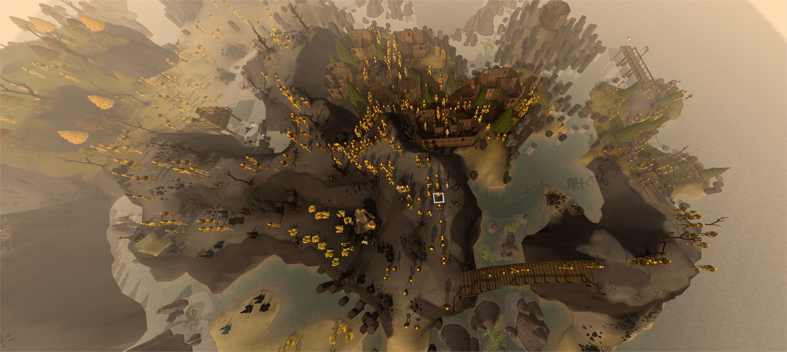

# Golems Don't Die

Golems you craft on Wyrmscraig should live forever.

A crafted golem normally steps off its plinth, wanders for about twenty seconds and
falls apart. This plugin makes them live forever — and they no longer stay on the island.

You can even name them.



## Golems abroad

On the island itself they use Wyrmscraig's own shortcuts — the rock climb on the west
cliff and the three basalt stepping-stone crossings. There are two ways off: the main
dock, or down into the caves and out through the dock inside them.

A golem that reaches either will sail. From there it walks the rest of Gielinor, using
the same ladders, stiles, shortcuts and ferries you do — it inherits your account, so a
shortcut you have the Agility for is a shortcut your golems have too. It climbs and jumps
and squeezes with the game's own animations, and the scenery it uses animates with it.

Golems will not use anything that needs an item you would have to carry, they never touch
the server, and they are visible only to you.

None of this costs anything while you are not looking. A golem outside your screen is
stored as a route and a departure time rather than being stepped, so the price of a
thousand golems wandering the world is roughly the price of the handful you can see.

## Settings

Golems roam freely and persist permanently. There is a limit
toggle, off by default, for anyone who notices the framerate dip after crafting 1000 golems.

The **Golems** side panel lists every golem currently ingame. Each golem can be given
a name or removed.

## Building

```
./gradlew jar
```

Requires a local RuneLite install in `~/.m2` (`./gradlew publishAllToMavenLocal` in the
runelite repo), or `repo.runelite.net` for the published client artifact.

## Credits

Collision map and transport data from [Shortest Path](https://github.com/Skretzo/shortest-path)
by Skretzo, BSD 2-Clause. Model and animation technique from
[Creator's Kit](https://github.com/ScreteMonge/creators-kit) by ScreteMonge.

## Licence

BSD 2-Clause. See [LICENSE](LICENSE).
