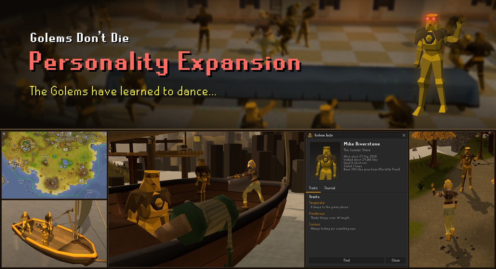

Golems should live forever.

Golem Crafting usually has Golems briefly wander around before dramatically dying of sadness about 20 seconds later. 
This plugin makes them continue to wander around indefinitely instead.

You can even name them.

---

**NEW UPDATE**

The golems have begun to work together and celebrate the little things in life.

Crews will now form when multiple golems wish to sail, celebrations will occur when the player achieves different things, and each golem now has a profile describing their personality and journey so far. Various small social interactions included.

Golems are now present on the world map, and the sidebar UI has been reworked and extended.

The pathfinding and collision model has been completely reworked.

**Patch 3.1:** Golems can now wear hats, picked from their info page. Very rarely, a freshly crafted golem can now receive a chisel drop.

---

**PREVIOUS UPDATE**

The golems figured out Sailing. They've trained Agility. They've even done quests.

#### They explore.

Golems now inherit your characters capabilities - they can access the same agility shortcuts and quest areas you can, and are *mostly* capable of getting there.

They can sail, use shortcuts, activate travel systems such as fairy rings or spirit trees, and even enter instances.

---

## Settings

**Golems**

| Setting | Default | |
|---|---|---|
| Limit golems | Off | Cap golems, for anyone who notices the framerate dip after crafting 1000+ golems. |
| Maximum golems | 25 | The cap, when Limit golems is on. |
| Show golem names | On | Show golem names above their head. |
| Name colour | Yellow (#FFE700) | The colour of the golem names, and how transparent they are. |
| World map | Named | Draws golems on the world map: Off, Named (golems you have named or starred) or All. Golems too close together to draw apart become one face with a count. |
| Restrict Golem ambition | Off | Keeps golems on Wyrmscraig. Golems do not sail, and any that are elsewhere return to Wyrmscraig. |
| Auto name golems | Off | Gives golems you have not named one anyway, in the name style below. A golem always gets the same name, and one you type yourself takes priority. |
| Name style | Default | The names auto naming gives. Default: a name from OSRS and a surname off the rocks. Ordinal: the order the golem was crafted in, in Latin.
| Enable sidebar | On | Shows the Golems tab. With it off, missing golems can still be revived by right-clicking a golem plinth. |
| Path to a golem being found | On | While you are finding a golem, the [Shortest Path](https://github.com/Skretzo/shortest-path) plugin draws the way to it. Does nothing without Shortest Path installed. |
| Golems join your ship | On | Golems standing near your boat when you step aboard come too. Not while golem ambition is restricted. |

**Celebrations**

Golems in view stop what they are doing, dancing and setting off fireworks.

| Setting | Default | |
|---|---|---|
| Level up | On | Golems dance when you gain a level. |
| Collection log | On | Golems dance when you fill a collection log slot. |
| Golem crafted | Off | Golems dance each time you craft another golem. |
| Quest complete | On | Golems dance when you finish a quest or miniquest. |
| Achievement diary | On | Golems dance when you finish a tier of an achievement diary. |
| Combat achievement | On | Golems dance when you complete a CA. |
| Pet | On | Golems dance when you receive a pet. |
| Personal best | On | Golems dance when you get a new PB. |
| Clue scroll | Off | Golems dance when you finish a clue scroll. |

**Obstacle data**

| Setting | Default | |
|---|---|---|
| Share obstacle data | Off | Sends the obstacle data the plugin keeps, so every player's golems can use those obstacles in a later update. See [Telemetry](#telemetry) below. |

## Interactions

- You can use the sidebar to rename golems, open their info page, or track them so you can find them ingame.
- You can respawn golems that the plugin didn't see you craft, so you don't miss out on golems if you installed the plugin late, or did some crafting on mobile. This can be done either through the sidebar or right clicking the plinth. If you aren't missing any, it won't appear.
- You can emote at golems that you find in the world and they may mimic you.
- Golems nearby will come on your ship with you when you set sail.
- Golems can be quickly renamed or have their info shown by shift-right-clicking them.
- You can star golems, which makes them always visible on the sidebar list, the map, and prioritises them joining your ship.
- You can search for a particular golem in the sidebar.
- You can give a golem a hat from its info page.
- Golems will learn how to use obstacles, entrances, and other transports based on what your player does. They may ignore certain paths or obstacles until you perform them yourself.

## Telemetry

The plugin keeps a record of some obstacles and transports the player crosses. With your permission, a setting can be toggled on to help development.
This setting sends the collected traversal data to a server. It does not share any account specific data, such as display name, world, or even time.

What is sent: each obstacle's ID and name as the game has them, the animations it played, how long it took, the tiles it joins, and the path across it measured from those tiles. For golems, the route they took over an obstacle, so obstacles they perform incorrectly can be fixed. Also, the plugin version.

## Credits

Transport data from [Shortest Path](https://github.com/Skretzo/shortest-path) by Skretzo, which also
draws the way to a golem being found. The collision map is now built from the game's own cache instead.

Place names from the region list in [Location Display](https://github.com/trinhc2/Location-Display) by
trinhc2, alongside the world map's own labels.

Model and animation technique from
[Creator's Kit](https://github.com/ScreteMonge/creators-kit) by ScreteMonge. 

Boat movement modelled
on [Turning Circles](https://github.com/anmcgrath/turning-circles) by anmcgrath. 

Dancing contributed by [NathanVegetable](https://github.com/Varzeki/golems-dont-die/pull/1), who took
the idea from [Dance Party](https://github.com/dekvall/runelite-external-plugins/tree/dance-party) by
dekvall. 

Latin ordinal names from the list [Hjaldr](https://github.com/Varzeki/golems-dont-die/issues/2)
contributed.

## Licence

BSD 2-Clause. See [LICENSE](LICENSE).
