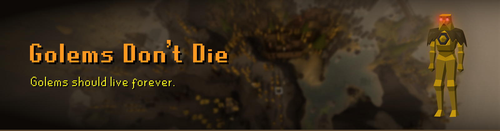
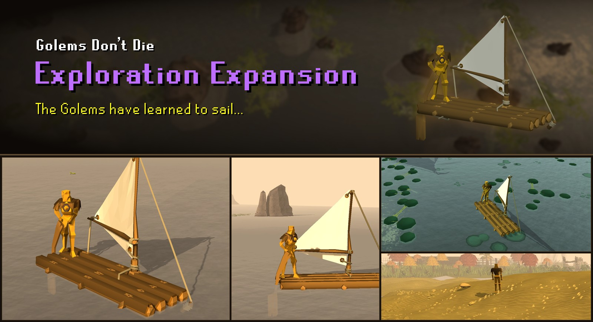

Golems should live forever.

Golem Crafting usually has Golems briefly wander around before dramatically dying of sadness about 20 seconds later. 
This plugin makes them continue to wander around indefinitely instead.

You can even name them.

---

**NEW UPDATE**


The golems figured out Sailing. They've trained Agility. They've even done quests.

### They explore.

Golems now inherit your characters capabilities - they can access the same agility shortcuts and quest areas you can, and are *mostly* capable of getting there.

They can sail, use shortcuts, activate travel systems such as fairy rings or spirit trees, and even enter instances.


---

## Settings

**Golems**

| Setting | Default | |
|---|---|---|
| Limit golems | Off | Cap golems, for anyone who notices the framerate dip after crafting 1000+ golems. |
| Maximum golems | 25 | The cap, when Limit golems is on. |
| Show golem names | On | Show golem names above their head. |
| Name colour | Yellow (#FFE700) | The colour of the golem names. |
| Golems on the world map | Named golems | Draws golems on the world map. Golems too close together to draw apart become one face with a count. |
| Restrict Golem ambition | Off | Keeps golems on Wyrmscraig. Golems do not sail, and any that are elsewhere return to Wyrmscraig. |

**Celebrations**

Golems in view stop what they are doing, dance for about ten seconds and set off fireworks.

| Setting | Default | |
|---|---|---|
| Level up | On | Golems dance when you gain a level. |
| Collection log | On | Golems dance when you fill a collection log slot. Needs the game's collection log chat message turned on. |
| Golem crafted | Off | Golems dance each time you craft another golem. |


## Finding a golem

The sidebar lists your golems nearest first, fifty to a page, with a search box for names. Under
each name is where that golem is — "Catherby", "Taverley Dungeon", "Sailing to Port Khazard".

**Find** points an arrow at a golem and keeps it there as the golem moves, until you come within
eight tiles of it or stop looking. While you are looking, that golem is the only one on the world
map, and its face sticks to the edge of the map when you pan away from it.

On the map, a named golem wears its name. Hover any face to see where it is.


## Building

```
./gradlew jar
```

Requires a local RuneLite install in `~/.m2` (`./gradlew publishAllToMavenLocal` in the
runelite repo), or `repo.runelite.net` for the published client artifact.


## Credits

Collision map and transport data from [Shortest Path](https://github.com/Skretzo/shortest-path) by Skretzo. 

Model and animation technique from
[Creator's Kit](https://github.com/ScreteMonge/creators-kit) by ScreteMonge. 

Boat movement modelled
on [Turning Circles](https://github.com/anmcgrath/turning-circles) by anmcgrath. 

Dancing contributed by [NathanVegetable](https://github.com/Varzeki/golems-dont-die/pull/1), who took
the idea from [Dance Party](https://github.com/dekvall/runelite-external-plugins/tree/dance-party) by
dekvall. Fireworks after [Death Party](https://github.com/DangItOSRS/death-party) by DangItOSRS. 

## Licence

BSD 2-Clause. See [LICENSE](LICENSE).
