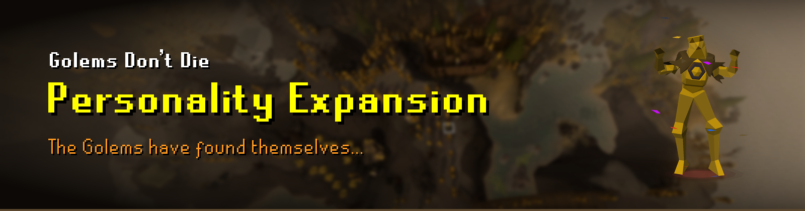

# Roadmap

## Exploration Expansion — in progress

Golems leave Wyrmscraig: they learn obstacles from your play, explore dungeons, instances and upper
floors, and sail between islands. See the README.

## Personality Expansion — planned

Golems become individuals you can follow.

1. **World map markers.** Named golems, or all of them, on the world map, with a tooltip. Positions
   of golems out of view already come from their routes, so this costs next to nothing.
2. **"Where is…" in the sidebar.** A rough location for each golem ("Sailing to Catherby",
   "Taverley Dungeon"), with a button to point a hint arrow or map flag at it.
3. **Follow a golem.** Pin one golem and watch its journey in the sidebar: where it is, where it is
   heading, and when it gets there.
4. **Travel log.** Each golem keeps its highlights: regions visited, dungeons reached, deepest floor,
   voyages sailed, tiles walked. Shown on its sidebar row or from a right-click "Chronicle".
5. **Traits.** A temperament per golem, fixed by its seed, that leans on the planner's chances:
   explorer (more transports, deeper), homebody (stays near Wyrmscraig), sailor (sails more),
   climber (seeks other floors).
6. **Greeting the player.** A golem next to you now and then waves or turns to face you.
7. **Crews on larger boats.** Golems leaving the same dock together sometimes crew one of the larger
   boats — a skiff or sloop — instead of each taking a raft.
